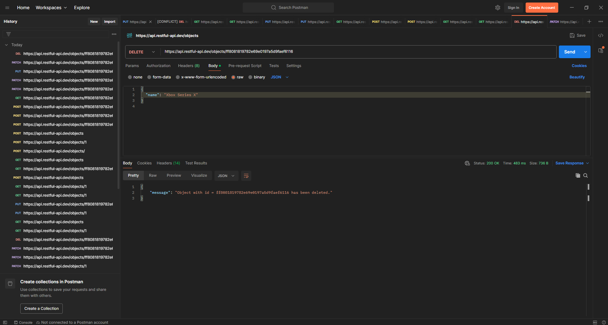

# Day8_Task

## **Tasks**
1. Downloaded and set up **Postman**
2. Used https://restful-api.dev/ for dummy APIs
3. Perform all **HTTP Methods** (GET, POST, PUT, PATCH, DELETE)

---

## **API Base URL**
```
https://api.restful-api.dev
```

---

## **1. GET – All Objects**


---

## **2. POST – Create New Object**


---

## **3. GET by ID – View Created Object**


---

## **4. PUT – Replace Entire Object**


---

## **5. PATCH – Update Partial Data**


---

## **6. DELETE – Remove the Object**



---

## ✅ **Task Completed**
- Installed Postman
- Used RESTful Dummy API
- Performed all HTTP methods
- Successfully tested CRUD operations  
